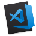

<!--
**mohammedsaid21/mohammedsaid21** is a ✨ _special_ ✨ repository because its `README.md` (this file) appears on your GitHub profile.

Here are some ideas to get you started:
- 🔭 I’m currently working on ...
- 🌱 I’m currently learning ...
- 👯 I’m looking to collaborate on ...
- 🤔 I’m looking for help with ...
- 💬 Ask me about ...
- 📫 How to reach me: ...
- 😄 Pronouns: ...
- ⚡ Fun fact: ...
-->

<h2>Hello World, I'm Mohammed 👋</h2>

<h3>
 
 I'm a software developer who is passionate about help new developers to find the right path.
 web front end developer, and very passionate about education and self development

</h3>

Languages and Tools:

 

<h3 font-weight:"bolder">fun fact:</h3> 
if I am not building something.
I would be thinking of building something
 

 
 
